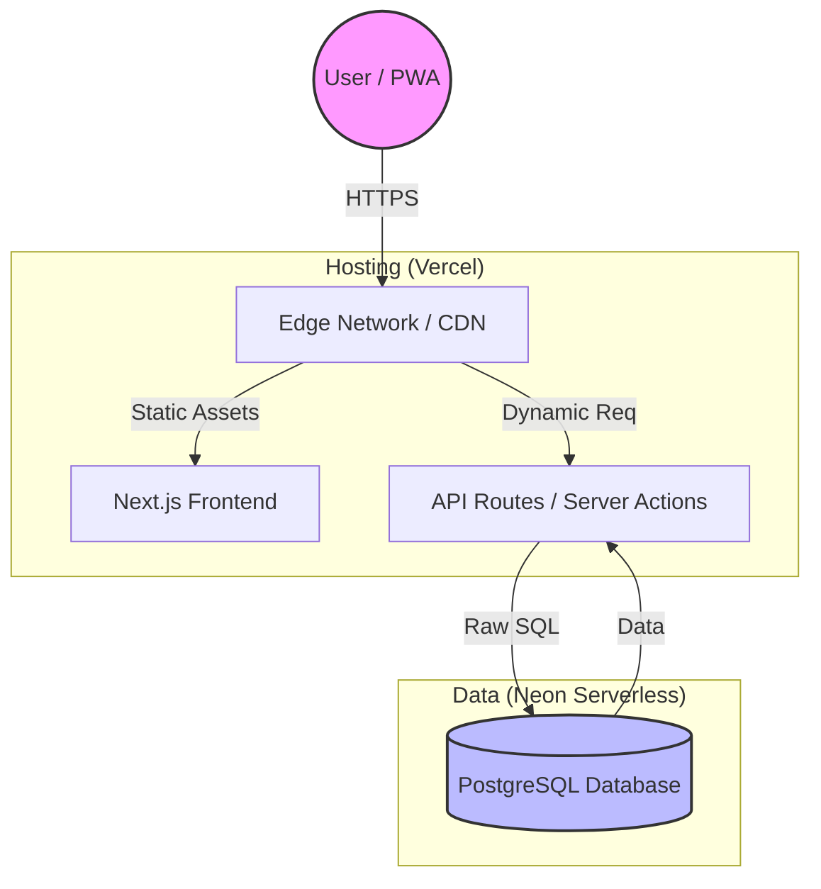

# 🧠 Architecture & Stack Decisions — Thought Process

This document captures **why each technology was chosen** and **how we structure our code**, ensuring the reasoning is not lost over time.

---

## Part 1: Infrastructure & Stack Decisions 🏗️

### 1️⃣ Frontend + Backend Framework — **Next.js**

| Factor | Consideration |
| :--- | :--- |
| **Cost** | Free on Vercel Hobby plan for internal apps |
| **Usage pattern** | Few users, bursty usage, mostly CRUD |
| **Why not separate frontend/backend** | Adds deployment + infra overhead with no benefit |
| **Why Next.js** | UI + backend (BFF) in one repo, zero extra services |
| **Why not plain React + API** | Would require separate hosting + routing + auth handling |
| **Risk accepted** | Tied to Vercel ecosystem |
| **Reasonable because** | App is internal, not a public SaaS |

➡️ **Decision**: Next.js reduces moving parts and deployment complexity to near zero.

---

### 2️⃣ Hosting Platform — **[Vercel](https://vercel.com/) (Hobby Plan)**

| Factor | Consideration |
| :--- | :--- |
| **Monthly cost** | ₹0 |
| **Limits considered** | 100 GB bandwidth, function execution limits |
| **CPU hours concern** | App is low traffic; functions run only on user actions |
| **URL stability** | Project URL remains stable across deployments |
| **Over-usage risk** | Low (few users, no background jobs) |
| **Why not VPS** | Always-on cost + maintenance |
| **Why not Cloudflare Workers** | More complex DB + Next.js integration |
| **Why Vercel** | Best support for Next.js, zero setup, fast iteration |

➡️ **Decision**: Vercel Hobby is sufficient **because the app is not always-on and not public**.

---

### 3️⃣ Database — **[Neon](https://neon.tech/) Serverless PostgreSQL**

| Factor | Consideration |
| :--- | :--- |
| **Monthly cost** | ₹0 on Hobby |
| **Free limits** | ~100 compute hours/month |
| **Why this fits** | App usage is **human-driven**, not automated |
| **Actual DB usage** | Only during CRUD actions (batch, baglet, status, harvest) |
| **Why not Azure SQL** | CPU/memory billed 24×7 even if unused |
| **Why not RDS / Cloud SQL** | Always-on instance cost |
| **Why not VPS Postgres** | Ops, backups, security, patching |
| **Over-usage risk** | Very low unless automated jobs added |
| **Risk accepted** | Cold starts + caching behaviour |

➡️ **Decision**: Neon gives **real PostgreSQL with near-zero cost**, matching our low, bursty usage.

---

### 4️⃣ Database Access — **Raw SQL (no ORM)**

| Factor | Consideration |
| :--- | :--- |
| **Cost** | Zero |
| **Complexity** | Explicit, but predictable |
| **Schema design** | Heavy use of joins, views, logs |
| **Why not ORM** | Hides SQL, hard to reason about performance |
| **Why raw SQL** | Full control, easier debugging |
| **Risk accepted** | Slightly more code |
| **Mitigation** | Centralized queries + views |

➡️ **Decision**: Raw SQL aligns better with **DB-first design** and operational clarity.

---

### 5️⃣ Runtime Choice — **Node + selective Edge**

| Factor | Consideration |
| :--- | :--- |
| **DB access** | Better in Node |
| **Latency-sensitive reads** | Edge where helpful |
| **Cost** | Same on Hobby |
| **Why not Edge everywhere** | DB drivers + transactions clearer in Node |

➡️ **Decision**: Choose runtime per route, not ideology.

---

### 6️⃣ 🚨 CRITICAL: Baglet Date Authority (Batch Prepare Date)

> [!IMPORTANT]
> **SOURCE OF TRUTH**: We strictly use `batch.prepared_date` as the single authoritative date for all Baglet age, history, and cohort calculations.

| Factor | Consideration |
| :--- | :--- |
| **Primary Pivot** | Switched from `logged_timestamp` to `batch.prepared_date` |
| **Why pivot** | Prevent "rebirthing" (heartbeats were overwriting system timestamps) |
| **Impact on stats** | Range filters (1M, 3M, 6M) now correctly reflect production cohorts |
| **Logic decision** | Age is calculated ONLY from the day the batch was started |

➡️ **Final Decision**: The **Batch Preparation Date** is the absolute source of truth. Do not use system-level timestamps for business metrics.

---

### 7️⃣ Timezone Management — **IST (India Standard Time)**

| Factor | Consideration |
| :--- | :--- |
| **Why IST** | The farm operation is physically located in India; logs must match lab clocks |
| **DB standard** | Database stores all timestamps in UTC, but computed via `now_ist()` |
| **Logic decision** | Never use raw `now()` in SQL to avoid server-region drift (UTC/US-East) |
| **Implementation** | Custom SQL function `now_ist()` returns `(now() at time zone 'utc' at time zone 'ist')` |

➡️ **Decision**: All business logs and status changes use **IST**. We use the custom `now_ist()` function for all timestamp insertions and updates to ensure lab-clock parity.

---

### 8️⃣ UI Philosophy — **Ultra-Dense (Reference: Baglet Monitoring Dashboard)**

| Principle | Implementation |
| :--- | :--- |
| **Why Ultra-Dense** | Optimized for pro-lab environments where data speed > whitespace |
| **Mobile Grid** | Stats (Total/Active/Health) grouped in single 3-column rows |
| **Card Layout** | `rounded-2xl` with `bg-white/5` border for clear unit separation |
| **High Contrast** | Metrics (Temp/Weight/ph) must use high-contrast white text |
| **Explicit Labels** | All metrics use small bold uppercase labels (e.g. `WEIGHT`) |
| **Visual Sync** | Range toggles must dim UI during "Syncing" state to show freshness |

➡️ **Standard**: All future monitoring screens must follow the **Baglet Monitoring Dashboard** design language for consistency.

---

## Part 2: Code & Folder Patterns 💡

### The Core Philosophy

#### Traditional Backend (NestJS, Spring, Laravel)
```
Controller → Service → Repository → Database
   ↓           ↓          ↓
  HTTP      Business    Data Access
Layer       Logic       Layer
```

**Why this exists:**
- **Dependency Injection** - Services can be injected, mocked, swapped
- **Class-based** - Encapsulation, inheritance, interfaces
- **Clear separation** - Each layer has a single responsibility

#### Next.js/React World
```
API Route/Server Component → lib functions → Database
      ↓                           ↓             ↓
   HTTP/RSC                  Business      Direct Query
                              Logic
```

**Why it's simpler:**
- **Functional paradigm** - React is functional, not OOP
- **No DI container** - Next.js doesn't have a built-in DI system
- **Colocation** - Business logic lives near where it's used
- **Flexibility** - Can call `lib` functions from API routes, Server Components, Server Actions, or even Client Components (via API)

---

### Deep Dive: Why `/lib` Works Better

#### 1. React Server Components (RSC) Changed Everything

**Before RSC (Next.js 12 and earlier):**
```tsx
// pages/batches/[id].tsx
export async function getServerSideProps() {
  // Had to fetch from your own API
  const res = await fetch(`/api/batches/${id}`)
  const data = await res.json()
  return { props: { data } }
}
```
❌ **You needed API routes as an intermediary**

**After RSC (Next.js 13+):**
```tsx
// app/batches/[id]/page.tsx
import { getBatchDetails } from '@/lib/batch-actions'

export default async function BatchPage({ params }) {
  // Directly call business logic!
  const batch = await getBatchDetails(params.id)
  return <div>{batch.name}</div>
}
```
✅ **You can call business logic directly from components**

**The insight:** 
- `/lib` functions can be called from **anywhere** (API routes, Server Components, Server Actions)
- `/services` with classes would need extra ceremony for this flexibility
- You'd end up instantiating service classes everywhere, defeating the purpose

#### 2. JavaScript Doesn't Need Services

In Java/C#, you'd write:
```java
// Java - Services make sense here
@Service
public class BatchService {
    @Autowired
    private BatchRepository repository;
    
    public Batch getBatch(String id) {
        return repository.findById(id);
    }
}
```

In Next.js, you'd write:
```typescript
// TypeScript - Just use functions!
export async function getBatch(id: string) {
  return await db.query.batches.findFirst({ where: eq(batches.id, id) })
}
```

**Why functions win:**
- ✅ **Less boilerplate** - No class instantiation, no decorators
- ✅ **Tree-shakeable** - Unused functions don't get bundled
- ✅ **Easier to test** - Pure functions are simpler to test than classes
- ✅ **Composable** - Functions compose better (`getBatch`, `updateBatch`, `deleteBatch` can all be separate imports)

#### 3. The "Repository" Layer is Often Unnecessary

**In traditional backends:**
```
Service calls → Repository → ORM → Database
```
**Purpose:** Abstract away the ORM so you can swap it later

**In Next.js with Drizzle/Prisma:**
```typescript
// lib/batch-actions.ts
export async function getBatch(id: string) {
  // Drizzle/Prisma IS your repository layer!
  return await db.query.batches.findFirst(...)
}
```

**The insight:**
- Modern ORMs (Drizzle, Prisma) are **already abstraction layers**
- They're type-safe and pleasant to use directly
- Adding another repository layer is often **YAGNI** (You Aren't Gonna Need It)
- If you DO need to swap databases, you'd likely refactor anyway

---

### Common Next.js Patterns

#### 1. `/lib` folder (Most Popular ✅)
```
lib/
├── batch-actions.ts      # Business logic functions
├── db.ts                 # Database utilities
├── utils.ts              # Helper functions
└── validations.ts        # Zod schemas, etc.
```
- **Why**: Next.js convention, seen in official examples
- **Use case**: General utilities and business logic

#### 2. `/actions` folder (Modern ✅)
```
actions/
├── batch-actions.ts      # Server Actions (Next.js 14+)
└── baglet-actions.ts
```
- **Why**: Next.js 14 Server Actions pattern
- **Use case**: When using `'use server'` for React Server Components

#### 3. `/services` folder (Less Common ⚠️)
```
services/
├── batch-service.ts
└── baglet-service.ts
```
- **Why**: Familiar to backend devs (Java, C#, NestJS)
- **Use case**: When you want OOP-style architecture
- **Downside**: Not idiomatic Next.js, can feel over-engineered

#### 4. `/repositories` folder (Database Layer 📊)
```
repositories/
├── batch-repository.ts   # Pure DB queries
└── baglet-repository.ts
```
- **Why**: Separates data access from business logic
- **Use case**: Complex apps with multiple data sources

---

### When You MIGHT Want `/services` 🤔

Here are legitimate reasons:

#### 1. Team Background
- Team comes from NestJS/Spring
- They're more productive with familiar patterns
- **Trade-off:** Not idiomatic Next.js, but team velocity matters

#### 2. Complex Domain Logic
```typescript
// services/billing-service.ts
export class BillingService {
  constructor(
    private stripeClient: Stripe,
    private emailService: EmailService,
    private auditLogger: AuditLogger
  ) {}
  
  async processBatchPayment(batchId: string) {
    // Complex multi-step workflow with state
  }
}
```
**When:** Stateful workflows with multiple dependencies

**Alternative in `/lib`:**
```typescript
// lib/billing.ts
export async function processBatchPayment(
  batchId: string,
  deps = { stripe, email, audit } // Dependency injection via params
) {
  // Same logic, functional style
}
```

#### 3. You're Building an Actual Backend
- Separate Next.js API from your actual backend
- Using tRPC, GraphQL, or similar
- **Then:** Use whatever pattern fits (NestJS, Express with services, etc.)

---

### Practical Decision Framework 🎯

| Question | `/lib` | `/services` |
|----------|--------|-------------|
| Will I call this from Server Components? | ✅ Easy | ❌ Extra work |
| Do I need stateful service instances? | ❌ No | ✅ Yes |
| Is my team from backend land? | ⚠️ Learning curve | ✅ Familiar |
| Do I use Next.js RSC features? | ✅ Natural fit | ❌ Fighting framework |
| Is the logic complex with many deps? | ⚠️ Can get messy | ✅ Better encapsulation |

---

### Our Current Pattern ✨

We use the `/lib` pattern in this project:

```typescript
// app/api/batches/[id]/add-baglet/route.ts
import { addBagletToBatch } from '@/lib/batch-actions'

export async function POST(req: Request) {
  // Thin controller - handles HTTP concerns
  const result = await addBagletToBatch(batchId)
  return NextResponse.json(result)
}
```

```typescript
// lib/batch-actions.ts
export async function addBagletToBatch(batchId: string) {
  // Business logic - can be called from anywhere
  return await db.transaction(async (tx) => {
    // Complex logic here
  })
}
```

**Why this works for us:**
- ✅ Can be called from API routes
- ✅ Can be called from Server Components
- ✅ Can be called from Server Actions
- ✅ Easy to test (just import and call)
- ✅ Follows Next.js conventions
- ✅ Scales well for our app size
- ✅ Functional and composable

---

### Database Query Guidelines 📊

#### Simple Queries → Keep in Route ✅
```typescript
// app/api/batches/route.ts
export async function GET() {
  const batches = await db.query.batches.findMany()
  return NextResponse.json(batches)
}
```
**Why:** Direct, easy to understand, no unnecessary abstraction

#### Complex Logic → Extract to `/lib` ✅
```typescript
// lib/batch-actions.ts
export async function addBagletToBatch(batchId: string) {
  return await db.transaction(async (tx) => {
    // 1. Calculate sequence
    // 2. Generate ID
    // 3. Insert baglet
    // 4. Update batch counts
    // 5. Log the action
  })
}
```
**Why:** Reusable, testable, transaction-safe

#### Extract When You Have:
- ❌ Complex business logic (multiple queries, calculations, validations)
- ❌ Reusable operations (used across multiple routes/pages)
- ❌ Transactions (multiple related database operations)
- ❌ Routes getting long (200+ lines)

---

### Key Takeaways

1. **`/lib` is the Next.js way** - It's in the official docs and widely adopted
2. **Functions over classes** - JavaScript/TypeScript shines with functional patterns
3. **Modern ORMs are enough** - Drizzle/Prisma already provide abstraction
4. **RSC changed the game** - Direct business logic calls from components is powerful
5. **Keep it simple** - Add layers when you need them, not preemptively
6. **Team context matters** - If `/services` makes your team more productive, use it

---

## Appendix: Reference Summary & Diagrams 🏗️

### Architecture Diagram



### Summary — Why This Stack Works *For Us*

*   **Internal tool**: No SEO or public traffic requirements.
*   **Low concurrency**: Used by a specific team, not the internet.
*   **No background jobs**: All actions are triggered by clicks.
*   **Heavy relational data**: Complex relationships fit SQL perfectly.
*   **Cost goal**: Must stay near zero.

This stack is **not generic** — it is tuned to **how this app is used**, not how tech blogs recommend.

---

## References

- [Next.js Project Structure](https://nextjs.org/docs/getting-started/project-structure)
- [React Server Components](https://react.dev/blog/2023/03/22/react-labs-what-we-have-been-working-on-march-2023#react-server-components)
- [Server Actions](https://nextjs.org/docs/app/building-your-application/data-fetching/server-actions-and-mutations)
