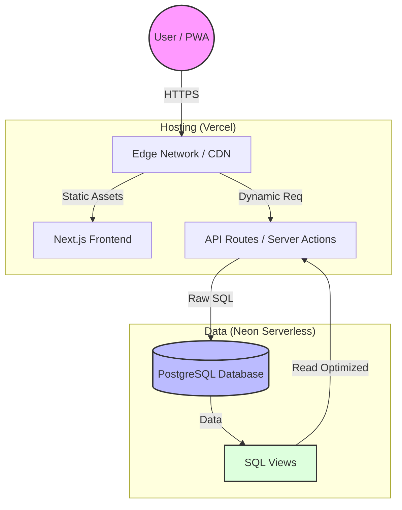

# 🧠 Architecture & Stack Decisions — Thought Process

This document captures **why each technology was chosen**, including **cost limits, usage patterns, risks, and rejected alternatives**, ensuring the reasoning is not lost over time.

---

## 1️⃣ Frontend + Backend Framework — **Next.js**

| Factor | Consideration |
| :--- | :--- |
| **Cost** | Free on Vercel Hobby plan for internal apps |
| **Usage pattern** | Few users, bursty usage, mostly CRUD |
| **Why not separate frontend/backend** | Adds deployment + infra overhead with no benefit |
| **Why Next.js** | UI + backend (BFF) in one repo, zero extra services |
| **Why not plain React + API** | Would require separate hosting + routing + auth handling |
| **Risk accepted** | Tied to Vercel ecosystem |
| **Reasonable because** | App is internal, not a public SaaS |

➡️ **Decision**: Next.js reduces moving parts and deployment complexity to near zero.

---

## 2️⃣ Hosting Platform — **[Vercel](https://vercel.com/) (Hobby Plan)**

| Factor | Consideration |
| :--- | :--- |
| **Monthly cost** | ₹0 |
| **Limits considered** | 100 GB bandwidth, function execution limits |
| **CPU hours concern** | App is low traffic; functions run only on user actions |
| **URL stability** | Project URL remains stable across deployments |
| **Over-usage risk** | Low (few users, no background jobs) |
| **Why not VPS** | Always-on cost + maintenance |
| **Why not Cloudflare Workers** | More complex DB + Next.js integration |
| **Why Vercel** | Best support for Next.js, zero setup, fast iteration |

➡️ **Decision**: Vercel Hobby is sufficient **because the app is not always-on and not public**.

---

## 3️⃣ Database — **[Neon](https://neon.tech/) Serverless PostgreSQL**

| Factor | Consideration |
| :--- | :--- |
| **Monthly cost** | ₹0 on Hobby |
| **Free limits** | ~100 compute hours/month |
| **Why this fits** | App usage is **human-driven**, not automated |
| **Actual DB usage** | Only during CRUD actions (batch, baglet, status, harvest) |
| **Why not Azure SQL** | CPU/memory billed 24×7 even if unused |
| **Why not RDS / Cloud SQL** | Always-on instance cost |
| **Why not VPS Postgres** | Ops, backups, security, patching |
| **Over-usage risk** | Very low unless automated jobs added |
| **Risk accepted** | Cold starts + caching behaviour |

➡️ **Decision**: Neon gives **real PostgreSQL with near-zero cost**, matching our low, bursty usage.

---

## 4️⃣ Database Access — **Raw SQL (no ORM)**

| Factor | Consideration |
| :--- | :--- |
| **Cost** | Zero |
| **Complexity** | Explicit, but predictable |
| **Schema design** | Heavy use of joins, views, logs |
| **Why not ORM** | Hides SQL, hard to reason about performance |
| **Why raw SQL** | Full control, easier debugging |
| **Risk accepted** | Slightly more code |
| **Mitigation** | Centralized queries + views |

➡️ **Decision**: Raw SQL aligns better with **DB-first design** and operational clarity.

---

## 5️⃣ Views (`v_strain_full`, `v_substrate_full`)

| Factor | Consideration |
| :--- | :--- |
| **Why views exist** | Reduce repeated joins in APIs |
| **Cost impact** | None |
| **Performance** | Acceptable for small datasets |
| **Why not compute in code** | Logic duplication + error-prone |
| **Risk accepted** | Schema coupling |
| **Benefit** | Clean dropdown APIs and simpler UI logic |

➡️ **Decision**: Views simplify APIs and make UI code dumb and safe.

---

## 6️⃣ Caching Strategy — **Manual Version System**

| Factor | Consideration |
| :--- | :--- |
| **Why caching needed** | Vercel + Neon may return cached reads |
| **Why not rely on platform invalidation** | Not guaranteed on Hobby |
| **Chosen approach** | Manual version token (e.g. `?v=timestamp`) |
| **Cost** | Zero |
| **Multi-user safety** | Version bumps on write |
| **Risk accepted** | Slight extra logic |
| **Benefit** | Deterministic behaviour |

➡️ **Decision**: Manual versioning gives **predictable freshness without paid plans**.

---

## 7️⃣ Runtime Choice — **Node + selective Edge**

| Factor | Consideration |
| :--- | :--- |
| **DB access** | Better in Node |
| **Latency-sensitive reads** | Edge where helpful |
| **Cost** | Same on Hobby |
| **Why not Edge everywhere** | DB drivers + transactions clearer in Node |

➡️ **Decision**: Choose runtime per route, not ideology.

---

## Summary — Why This Stack Works *For Us*

*   **Internal tool**: No SEO or public traffic requirements.
*   **Low concurrency**: Used by a specific team, not the internet.
*   **No background jobs**: All actions are triggered by clicks.
*   **Heavy relational data**: Complex relationships fit SQL perfectly.
*   **Cost goal**: Must stay near zero.

This stack is **not generic** — it is tuned to **how this app is used**, not how tech blogs recommend.

---

## 🏗️ Architecture Diagram

